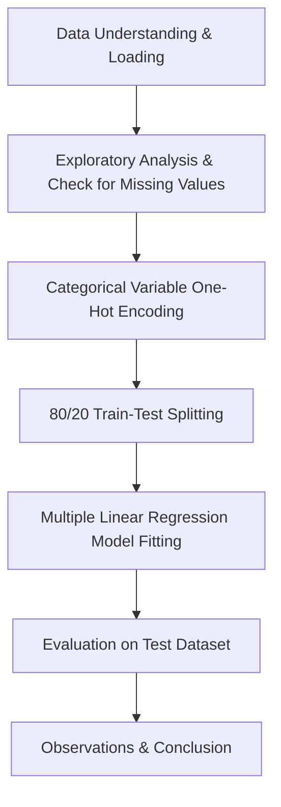
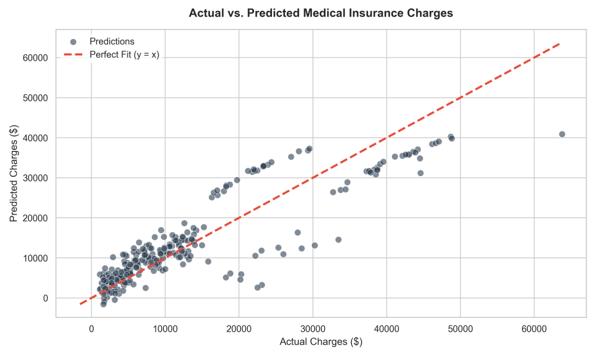

###### mponline-aiml-assg1

# Medical Cost Personal Insurance Prediction

This repository contains the implementation of a **Multiple Linear Regression** model to estimate individual medical insurance charges using personal and health-related demographic information.

## Objective
An insurance company wants to estimate the medical insurance charges of customers based on their personal and health-related information (such as age, BMI, smoker status, region, etc.). The goal of this project is to develop and evaluate a Multiple Linear Regression model that predicts these charges and helps identify the key factors driving medical costs.

## Dataset Link
- **Source:** [Kaggle - Medical Cost Personal Datasets](https://www.kaggle.com/datasets/mirichoi0218/insurance)

The dataset consists of **1,338 records** and **7 variables**:
- `age`: Age of primary beneficiary (numerical)
- `sex`: Insurance contractor gender (female, male)
- `bmi`: Body mass index (numerical, kg/m²)
- `children`: Number of children/dependents covered by health insurance (numerical)
- `smoker`: Smoking status (yes, no)
- `region`: Residential area in the US (northeast, northwest, southeast, southwest)
- `charges`: Individual medical costs billed by health insurance (numerical, **target variable**)

## Libraries Used
- **Pandas**: Data loading, exploration, and categorical variable encoding.
- **NumPy**: Numerical operations.
- **Scikit-Learn**: Splitting datasets, training the Linear Regression model, and calculating evaluation metrics.
- **Matplotlib & Seaborn**: Creating professional, high-resolution visualizations.

---

## Methodology

The machine learning workflow is structured as follows:

1. **Data Understanding**: Loaded the dataset and identified numerical features, categorical features, and the target variable.
2. **Data Preprocessing**:
   - Checked for missing values (none were present in the dataset).
   - Encoded the categorical variables (`sex`, `smoker`, `region`) using **One-Hot Encoding** (`pd.get_dummies` with `drop_first=True` to avoid the dummy variable trap / multi-collinearity).
   - Separated the features ($X$) and the target variable ($y$).
   - Split the dataset into **80% training data** (1,070 records) and **20% testing data** (268 records) with a fixed `random_state=42` to guarantee reproducibility.
3. **Model Development**: Trained a Multiple Linear Regression model using Scikit-Learn.
4. **Model Evaluation**: Evaluated model performance on the test set using MAE, MSE, RMSE, and $R^2$ Score.
5. **Visualization**: Plotted the Actual vs. Predicted charges to evaluate performance across different charge tiers.

---

## Results

### Model Performance Metrics
The trained Multiple Linear Regression model achieved the following performance metrics on the test dataset:

| Metric | Value |
| :--- | :--- |
| **Mean Absolute Error (MAE)** | $4,181.19 |
| **Mean Squared Error (MSE)** | $33,596,915.85 |
| **Root Mean Squared Error (RMSE)** | $5,796.28 |
| **R² Score (Coefficient of Determination)** | **0.7836** (78.36%) |

### Features and Trained Coefficients
The model's intercept was calculated as **-$11,931.22**. The coefficients associated with each preprocessed feature are detailed below:

| Feature | Coefficient | Interpretation |
| :--- | :--- | :--- |
| **smoker_yes** | +$23,651.13 | Being a smoker increases medical charges by ~$23,651, holding all else constant. |
| **children** | +$425.28 | Each additional child/dependent increases charges by ~$425. |
| **bmi** | +$337.09 | Each unit increase in BMI increases charges by ~$337. |
| **age** | +$256.98 | Each additional year of age increases charges by ~$257. |
| **sex_male** | -$18.59 | Gender has an extremely negligible effect on charges in this model. |
| **region_northwest** | -$370.68 | Living in the northwest region slightly decreases charges compared to northeast. |
| **region_southeast** | -$657.86 | Living in the southeast region slightly decreases charges compared to northeast. |
| **region_southwest** | -$809.80 | Living in the southwest region slightly decreases charges compared to northeast. |

### Visualizing Predictions
Below is the scatter plot displaying the **Actual vs. Predicted** charges. The red dashed line represents a perfect fit ($y = x$).

### Key Observations
1. **Smoker status is the single most dominant factor** driving medical costs. Its coefficient is exceptionally large (~$23,651) compared to all other features.
2. **The model fits relatively well ($R^2 = 0.7836$)**, meaning over 78% of the variance in medical charges is explained by these 6 features.
3. **Presence of non-linear tiers**: The scatter plot reveals distinct "stripes" or tiers of data points. For high-cost claims, the model consistently underpredicts charges. This suggests that the relationship between features and charges contains non-linearities or interaction effects (such as the combined effect of high BMI and smoking) which a basic linear model cannot fully represent.

---

## Conclusion
This project successfully developed a Multiple Linear Regression model predicting medical insurance charges with an $R^2$ score of 0.783. The analysis reveals that smoking status is the most dominant factor, increasing charges by over $23,600, followed by age and BMI, which also show a positive correlation with medical costs. Gender and residential region show negligible impacts on insurance charges.

A primary limitation of Linear Regression in this context is its assumption of linearity and additivity. The model cannot naturally capture the non-linear interaction effect between smoking and high BMI (where obese smokers face disproportionately higher charges), leading to underpredictions at higher charge ranges.

